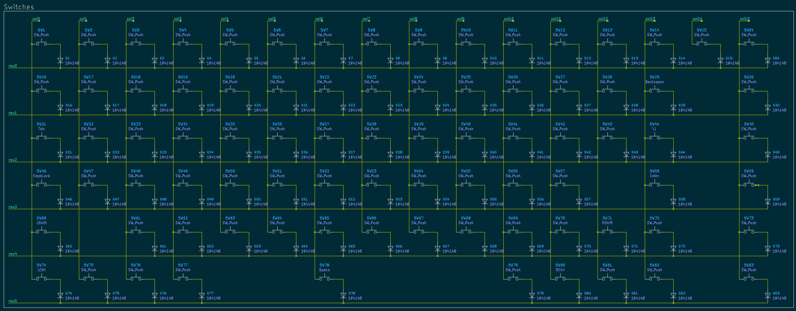
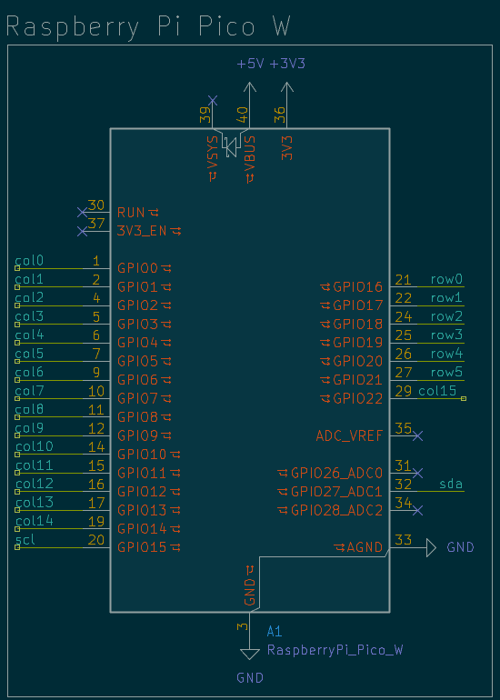
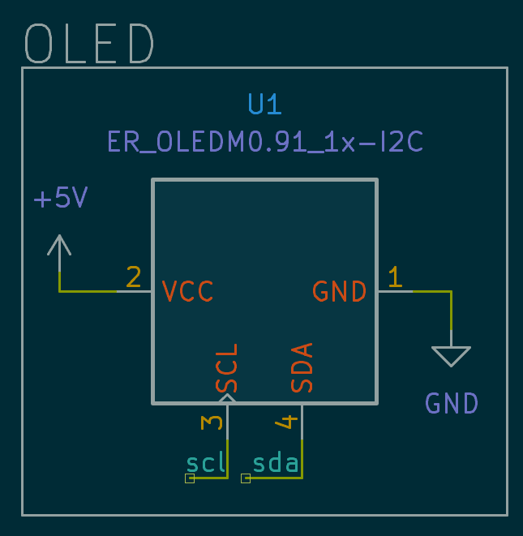
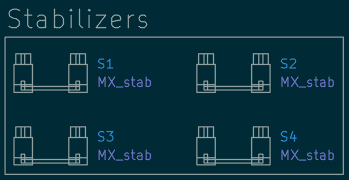
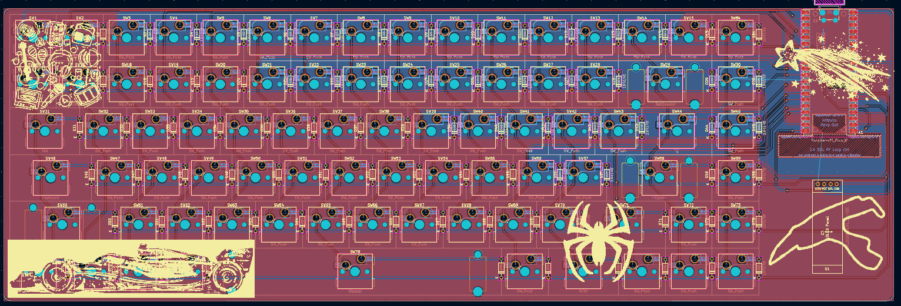
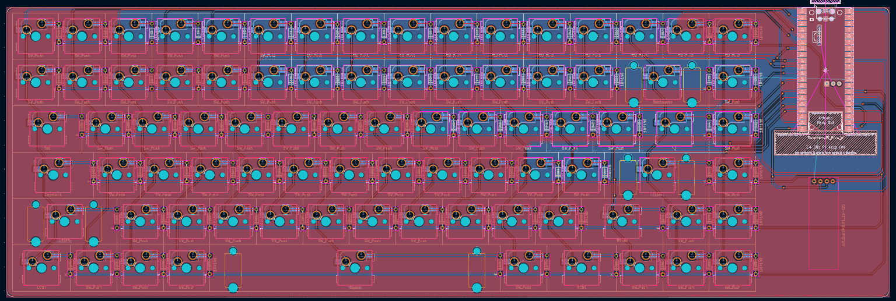
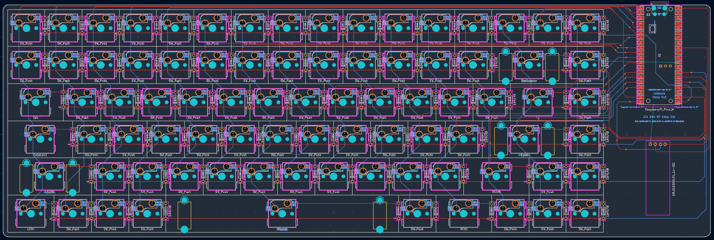
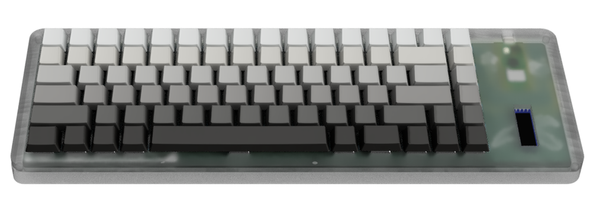
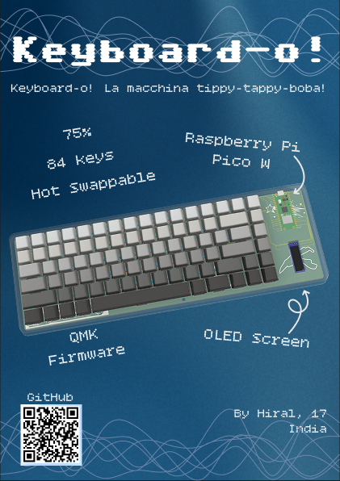

# Keyboard

This is a hot swappable 84-keys keyboard with an OLED screen. It has Raspberry Pi Pico W as its MCU. Its a cool project. Making my own keyboard, I could choose whether I want the switches to be linear, tactile or clicky, what colour do I want them and keycaps to be. I chose linear because they are quiter compared to clicky. For colours, I decided to do black. That's why everything, including the PCB, is black or in shades of black.

## Schematic

This is the schematic for the keyboard. It has a 16 x 6 matrix for the switches, a symbol for the OLED and the Raspberry Pi pico W.

### Switches

This is the wiring for the switches. It is arranged in a matrix of 16 x 6 with a diode for each switch to prevent phantom presses.

### MCU

Raspberry Pi Pico W felt like the best choice. It has the perfect amount of GPIO pins I needed for my 84 keys keyboard.

### OLED

I had a spare 0.91 inch OLED so I thought why not add it in my custom keyboard.

### Stabilizers

Some keys such as backspace, enter, left shift and space requires stabilizers as they are 2u or more to balance and support them.

## PCB

This is my PCB for the keyboard. It has GND pour on both layers-top and bottom. It features some silkscreen art too.

The source files can be found in the PCB folder and the gerbers in the Production folder.

### No Art

Below is the image of the PCB with no silkscreen art.

### Footprints only

This is the pic of the PCB with only the footprints and the routing.

## Case

I have two parts-top and bottom. I plan to join them together using magnets. I have 5mm x 2mm circles cut into the corners of the case to glue the magnets and make the case look seamless. Or I can use the bottom case only.

The source files can be found in the CAD folder.

## BOM

For the items link, please go to [BOM](BOM.csv).

| Item | Description | Quantity | Unit Price ($) | Total Price ($) |
|---|---|---|---|---|
| PCB | PCB | 5 | 4.92 | 24.6 |
| Akko V3 Cream Black Pro Switch (Pack of 45) | Switches | 2 | 12.51 | 25.02 |
| Veekos Gradient Keycaps (Cherry Profile) (135 keys) | Keycaps | 1 | 13.55 | 13.55 |
| 0.91 inch Blue OLED Display Module | OLED | 1 | 1.55 | 1.55 |
| Raspberry Pi Pico W (wireless) | MCU | 1 | 6.78 | 6.78 |
| 1N4148 1W Zener Diode | Diode | 84 | 0.013 | 1.10 |
| 5mm x 2mm Neodymium Magnet Disc | Magnet | 8 | 0.16 | 1.25 |
| Total | | | | 73.85 |

## Zine

This was designed in Figma.

## Why did I make this?

I have always wanted a compact keyboard for my desk but with most of the functionality. Making a 75% keyboard fulfils that intention. Everything is custom about it. I can change the firmware whenever I want, swap out the switches or keycaps. It was a fun project.